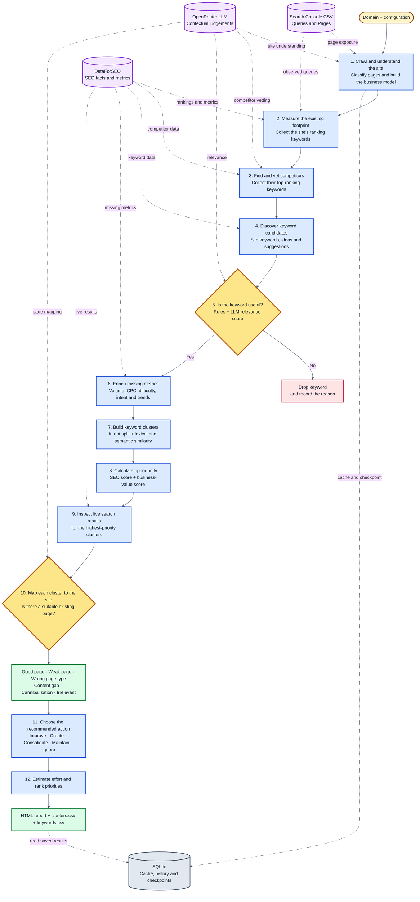

# kwresearch: SEO opportunity finder

Takes a website and returns a prioritised list of **page actions**: which existing pages to improve, which new pages to create, and in what order.

- **DataForSEO (REST)** supplies the facts: volume, CPC, KD, intent, rankings and competitors. It is cached, cost-tracked and capped by a budget.
- **Optional Search Console CSVs** supply observed queries, page exposure, clicks and average position for the site being researched.
- **The LLM (via OpenRouter, any model)** makes the judgement calls: business relevance, competitor vetting and cluster-to-page mapping. It never produces a metric.
- **Deterministic Python** handles everything else: normalisation, clustering, scoring and the report.

## Quick start

```bash
python3 -m venv .venv && source .venv/bin/activate
pip install -e ".[dev]"                 # core
pip install -e ".[embeddings]"          # optional: local semantic clustering (sentence-transformers)

# 1. Offline demo with fake data. No keys and no spend.
kwresearch run --domain acmelineage.io --mock
open runs_mock/acmelineage_io/run_1/report.html

# 2. Real run
cp .env.example .env                    # add DataForSEO login/password + OpenRouter key
cp config.example.yaml config.yaml      # set domain, country, business context
kwresearch run --config config.yaml

# Read saved API spend for every Algoscale run; this makes no provider API calls.
kwresearch costs --config configs/algoscale.com.yaml

# Optional: use Search Console CSV exports (Queries, Pages, or both)
kwresearch run --config config.yaml --gsc-csv /path/to/Queries.csv --gsc-csv /path/to/Pages.csv
```

Each run creates `runs/<domain>/run_<id>/report.html`, `clusters.csv` and `keywords.csv`, plus a SQLite DB at `runs/<domain>/kwresearch.db`. The DB keeps every run, so metric history builds up over time.

`--gsc-csv` accepts a Google Search Console performance CSV with `Top queries` or `Top pages` as its first column, followed by `Clicks,Impressions,CTR,Position`. Repeat the option for both exports. A Pages export like `algoscale.com-google-search-console2026.csv` prioritises observed pages during crawling and provides page performance to mapping. A Queries export adds actual search terms to keyword discovery, keeps terms with observed impressions eligible for relevance review, and uses their observed position and exposure in opportunity scoring. Search Console impressions remain separate from DataForSEO monthly search volume. The report CSVs include the imported query metrics. Supply exports for the domain being researched; use a new run when the CSV content changes. Domain-property exports may include subdomains; only pages on the crawled host affect page selection and mapping.

### Resuming and re-running

```bash
kwresearch run --config config.yaml --resume                     # continue after a crash or budget stop
kwresearch run --config config.yaml --resume --force mapping score   # redo phases after tuning prompts or weights
kwresearch report --config config.yaml                           # re-render only
```

Resuming is cheap because every DataForSEO and LLM response is cached in the DB. DataForSEO responses are kept for 30 days. LLM responses are keyed by prompt. The DataForSEO budget includes spend already recorded for that run before the resume.

The CLI prints overall phase progress plus progress for long-running crawl, keyword, SERP and LLM
batches. If the process is interrupted, OpenRouter credits run out, or an API call ultimately fails,
the current run is marked `interrupted` and the CLI prints the exact resume command. Add credits or
fix the error, then run that command. Completed phases are skipped and successful calls from the
interrupted phase are served from the cache, so they are not purchased again.

Independent requests run with bounded concurrency. `limits.llm_workers` defaults to 12 and
`limits.dataforseo_workers` defaults to 5; set either to `1` to disable parallel calls. These values
are intentionally conservative. DataForSEO documents a limit of 30 simultaneous requests for its
database-backed APIs, while OpenRouter limits vary by model/provider and return HTTP 429 when
capacity is exceeded. DataForSEO traffic is additionally paced to a steady 300 requests/minute.
Both clients retry transient failures with exponential backoff and jitter, and queued work is
cancelled if a parallel request ultimately fails.

Because DataForSEO reports a request's price only after completing it, requests already in flight
can finish just after `max_cost_usd` is reached. The possible overrun is bounded by
`dataforseo_workers`; use `1` when an exact sequential spending guard matters more than speed.

## Pipeline

The diagram uses explicit high-contrast colours so it remains readable in both GitHub light and dark modes.



| # | Phase | Source | Output |
|---|-------|--------|--------|
| 0 | `gsc` | optional Search Console Queries and Pages CSVs | observed query and page metrics for this run |
| 1 | `site` | crawler + LLM | pages (type, topics, conversion value) and a business model with seed topics |
| 2 | `footprint` | Labs `ranked_keywords` + optional Search Console queries | what you already rank for (quick-win raw material) |
| 3 | `competitors` | Labs `competitors_domain` (falls back to `serp_competitors`) + LLM vetting | top N real competitors and their top-20 keywords |
| 4–5 | `discovery` | `keywords_for_site`, `keyword_ideas`, `keyword_suggestions`, observed queries and page topics | candidate pool |
| 6 | `filter` | rules, then LLM relevance scored 0–5 (fast model, 150 keywords per call) | relevant keywords |
| 7 | `enrich` | `bulk_keyword_difficulty`, `search_intent` for **gaps only** | complete metrics + history rows |
| 9–10 | `cluster` | intent split → lexical/core_keyword units → embeddings (agglomerative) | clusters + primary keyword |
| 12–13 | `prescore` | metrics | SEO-opportunity and business-value scores |
| 8 | `serp` | live SERP for the **primary keyword of the top N clusters** | which page type Google rewards |
| 11 | `mapping` | LLM for the top N clusters, heuristic for the tail | EXISTING_GOOD / WEAK / WRONG_PAGE_TYPE / GAP / CANNIBALIZATION / IRRELEVANT |
| 14–15 | `score` | rules | action, effort, quadrant, final order |
| – | `report` | Jinja | HTML + CSV |

## Scoring

```
SEO opportunity = 0.30 demand + 0.30 feasibility(100-KD) + 0.20 existing-rank + 0.10 competitor-gap + 0.10 trend
Business value  = 0.55 LLM relevance + 0.30 intent value + 0.15 CPC percentile
Priority        = sqrt(SEO × Business)      ← both must be high; easy but worthless terms sink
Order           = Priority × (1 − 0.3 × Effort/100)
```

Existing-rank points: positions 11–20 = 100, 4–10 = 70, 21–30 = 60, 31–50 = 40, >50 = 15, 1–3 = 10 (little upside left).

When query CSV data is present, Search Console average position fills the existing-rank signal if no DataForSEO ranking is known. Observed query impressions and position add a configurable `weights.gsc_opportunity` signal (default 0.10) only to clusters with query data. Impressions are not treated as monthly search volume.

Actions: `QUICK_WIN`, `OPTIMIZE_EXISTING`, `CONSOLIDATE`, `NEW_LANDING_PAGE`, `SUPPORTING_CONTENT`, `STRATEGIC`, `MAINTAIN`, `IGNORE`. All weights, thresholds and intent values live in `config.yaml`.

## Cost control

- `limits.max_cost_usd` is a hard stop on DataForSEO spend. When it hits, the pipeline finishes with cached data and flags the report as partial.
- SERP calls cover only `serp_checks` clusters, and LLM mapping covers only `llm_mapping_clusters`.
- Rule filters run before the LLM, and `max_candidates` caps what the LLM sees.
- The "Method & cost" section of the report shows the recorded total and spend per provider. `kwresearch costs --config configs/algoscale.com.yaml` lists the cost of each saved run; add `--run-id N` for one run. This command reads SQLite only and never contacts DataForSEO or OpenRouter.
- Costs come from the original [DataForSEO response's `cost` field](https://docs.dataforseo.com/v3/dataforseo_labs-keyword_suggestions-live/) and [OpenRouter's included `usage.cost`](https://openrouter.ai/blog/announcements/smarter-charts-inline-svgs-and-live-usage-accounting/). Local cache hits add no new run cost. If a response omits its price, the report marks the total as incomplete instead of counting that request as free. Requests that fail without any provider response cannot be reconciled from local data. Older runs may contain zero values recorded by the previous version when OpenRouter omitted a price.

## Layout

```
kwresearch/
  clients/   dataforseo.py (REST + cache + budget) · llm.py (OpenRouter JSON) · embeddings.py
  pipeline/  site · footprint · competitors · discovery · candidates · filter · enrich · cluster · serp · mapping · scoring
  report/    render.py + templates/report.html
  runner.py  phase orchestration and checkpoints
  mock.py    offline fakes (demo + tests)
tests/       unit tests + full mocked pipeline
```

## Roadmap ideas (v2)

- **Personal KD:** use DataForSEO Backlinks `summary` for your domain versus the SERP's domains, so feasibility reflects *your* authority and not just the global KD.
- **SERP-overlap clustering** for the top clusters: merge when 3 or more of the top 10 URLs are shared.
- **Page content briefs:** for each new page, pull headings from the top 5 SERP results and generate a brief.
- **Tracking:** re-run monthly and diff `keyword_metrics_history` and `rankings` to show progress.
- Wrap `run_pipeline` in a FastAPI job endpoint once the report is validated.
